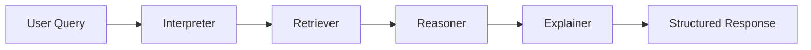

# ⚖️ LawLens — Pakistani Penal Code (PPC) AI Interpreter

LawLens is an advanced AI-powered legal assistant that helps users understand the Pakistan Penal Code (PPC) using cutting-edge technologies including Retrieval-Augmented Generation (RAG), LangGraph multi-agent reasoning, and Google Gemini for legal simplification.

## 🧠 Core Features

### 🔍 **Semantic Legal Search**
- FAISS-based vector search through PPC sections
- Sentence transformers for semantic understanding
- Real legal text chunked and cleaned from official PPC PDF
- Intelligent retrieval of relevant legal sections

### 🧑‍⚖️ **Multi-Agent Legal Reasoning**
LangGraph-based pipeline with specialized agents:
- **Interpreter**: Analyzes user intent and legal context
- **Retriever**: Finds relevant PPC sections using semantic search
- **Reasoner**: Applies legal reasoning to retrieved sections
- **Explainer**: Generates plain-language explanations using Gemini

### 🤖 **AI-Powered Legal Analysis**
- Google Gemini integration for natural language explanations
- Structured legal analysis with confidence scoring
- Multi-language support (English/Urdu)
- Comprehensive legal guidance with civil remedies

### 🌐 **Modern Web Interface**
- React + TypeScript frontend with Vite
- Tailwind CSS for beautiful, responsive design
- Real-time legal analysis with structured output
- Downloadable legal reports in PDF format

---

## 📁 Project Architecture

```
LAWLENS/
├── 📂 corpus/                    # Legal corpus and FAISS index
│   ├── cleaned_ppc_chunks.json   # Processed legal sections
│   ├── cleaned_ppc.txt           # Extracted PPC text
│   ├── raw_ppc.pdf              # Original PPC document
│   └── faiss_index/             # Vector search index
│       └── metadata.json        # Section metadata
├── 📂 frontend/                  # React + Vite web interface
│   ├── src/
│   │   ├── components/          # React components
│   │   │   ├── LawLensForm.tsx     # Incident submission form
│   │   │   ├── ReportPage.tsx      # Main analysis display
│   │   │   ├── ConfidenceScore.tsx # Confidence visualization
│   │   │   ├── LegalAlertBanner.tsx # Critical alerts
│   │   │   ├── UserRights.tsx      # User rights display
│   │   │   ├── Disclaimer.tsx      # Legal disclaimers
│   │   │   └── DownloadReport.tsx  # Report download
│   │   ├── App.tsx              # Main application
│   │   └── main.tsx             # Entry point
│   ├── package.json             # Frontend dependencies
│   └── vite.config.ts           # Build configuration
├── 📂 gemini_api/               # Google Gemini integration
│   └── client.py                # Gemini API client
├── 📂 langgraph_utils/          # Multi-agent reasoning system
│   ├── graph_builder.py         # LangGraph workflow definition
│   └── nodes/                   # Specialized agent nodes
│       ├── interpreter.py       # Intent analysis
│       ├── retriever.py         # Legal section retrieval
│       ├── reasoner.py          # Legal reasoning
│       └── explainer.py         # Explanation generation
├── 📂 rag/                      # RAG pipeline components
│   ├── chunker.py              # Text chunking
│   ├── embedder.py             # Embedding generation
│   ├── retriever.py            # FAISS retrieval
│   └── pdf_to_cleaned_txt.py   # PDF processing
├── 📂 vectorstore/              # Vector database
│   └── indexer.py              # FAISS index management
├── 📂 ui/                       # Backend API
│   ├── api_server.py           # FastAPI server
│   └── simple_cli.py           # Command-line interface
├── 📂 tests/                    # Test cases
│   └── demo_inputs.json        # Sample legal queries
├── extract_pdf_text.py         # PDF text extraction
├── requirements.txt             # Python dependencies
└── readme.md                   # This file
```

---

## 🚀 Getting Started

### Prerequisites

- Python 3.8+
- Node.js 16+
- Google Gemini API key

### 1. Environment Setup

```bash
# Clone the repository
git clone <repository-url>
cd LawLens

# Create virtual environment
python -m venv venv
source venv/bin/activate  # On Windows: venv\Scripts\activate

# Install Python dependencies
pip install -r requirements.txt
```

### 2. Configure API Keys

Create a `.env` file in the root directory:

```env
GEMINI_API_KEY=your_gemini_api_key_here
```

### 3. Prepare Legal Corpus

```bash
# Extract text from PPC PDF
python extract_pdf_text.py

# Process and chunk legal text
python rag/chunker.py

# Generate embeddings
python rag/embedder.py

# Build FAISS index
python vectorstore/indexer.py
```

### 4. Start Backend API

```bash
# Start FastAPI server
uvicorn ui.api_server:app --reload --host 0.0.0.0 --port 8000
```

### 5. Start Frontend

```bash
# Navigate to frontend directory
cd frontend

# Install dependencies
npm install

# Start development server
npm run dev
```

The application will be available at:
- **Frontend**: http://localhost:5173
- **Backend API**: http://localhost:8000

---

## 🧑‍⚖️ How It Works

### 1. **User Input Processing**
Users submit incident details through the React form:
- Incident description
- Location
- Time (optional)

### 2. **Multi-Agent Analysis Pipeline**



**Interpreter Node**: Analyzes the legal intent and context of the user's query.

**Retriever Node**: Uses FAISS to find relevant PPC sections based on semantic similarity.

**Reasoner Node**: Applies legal reasoning to the retrieved sections and user's situation.

**Explainer Node**: Uses Gemini to generate comprehensive, plain-language legal guidance.

### 3. **Structured Legal Analysis**

The system provides:
- **Criminal Aspects**: Applicable PPC sections and punishments
- **Civil Remedies**: Available civil legal options
- **Legal Procedures**: Step-by-step guidance
- **Confidence Score**: Reliability assessment (0-100%)
- **Critical Alerts**: Urgent legal warnings
- **User Rights**: Relevant legal protections

### 4. **Report Generation**

Users can download comprehensive legal reports including:
- Complete analysis in structured format
- Applicable legal sections
- Procedural guidance
- Civil remedy options
- Legal disclaimers

---

## 🧪 Testing

### Sample Queries

The system includes test cases in `tests/demo_inputs.json`:

```json
[
  {
    "query": "What is the punishment for marrying again during the lifetime of a spouse?",
    "expected_section": "494",
    "expected_keywords": ["marrying", "again", "lifetime", "husband", "wife"]
  },
  {
    "query": "What if someone sells fake prize bonds?",
    "expected_section": "89-G",
    "expected_keywords": ["counterfeiting", "prize bond", "unauthorized sale"]
  }
]
```

### Running Tests

```bash
# Test the backend API
python -m pytest tests/

# Test specific components
python test.py
```

---

## 🔧 Technical Stack

### Backend Technologies
- **Python 3.8+**: Core programming language
- **FastAPI**: High-performance web framework
- **LangGraph**: Multi-agent reasoning framework
- **FAISS**: Vector similarity search
- **Sentence Transformers**: Text embeddings
- **Google Gemini**: AI text generation
- **PyMuPDF**: PDF processing

### Frontend Technologies
- **React 18**: UI framework
- **TypeScript**: Type-safe development
- **Vite**: Fast build tool
- **Tailwind CSS**: Utility-first styling
- **Axios**: HTTP client
- **Marked**: Markdown parsing

### AI/ML Technologies
- **LangChain**: LLM orchestration
- **FAISS**: Vector database
- **Sentence Transformers**: Text embeddings
- **Google Gemini**: Large language model

---

## 📊 Key Features Explained

### 🔍 **Semantic Search**
- Uses `all-MiniLM-L6-v2` model for 384-dimensional embeddings
- FAISS IndexFlatL2 for fast similarity search
- Retrieves top-k most relevant legal sections

### 🧑‍⚖️ **Multi-Agent Reasoning**
- **State Management**: TypedDict for structured state flow
- **Agent Specialization**: Each node has specific legal expertise
- **Error Handling**: Graceful degradation for missing data

### 🌐 **Modern UI/UX**
- **Responsive Design**: Works on all device sizes
- **Real-time Feedback**: Loading states and progress indicators
- **Accessibility**: Screen reader friendly
- **Dark Theme**: Professional legal interface

### 📄 **Report Generation**
- **Structured Output**: Organized legal analysis
- **Downloadable**: PDF and text formats
- **Comprehensive**: All relevant legal aspects covered

---

## 🚨 Legal Disclaimer

⚠️ **Important**: LawLens is designed for educational and informational purposes only. It is not a substitute for professional legal advice. Users should consult qualified legal professionals for specific legal matters.

### Key Limitations:
- Not a replacement for legal counsel
- May not cover all legal scenarios
- Should not be used for emergency legal situations
- Always verify information with official sources

---

## 🤝 Contributing

### Development Setup

1. Fork the repository
2. Create a feature branch
3. Make your changes
4. Add tests for new functionality
5. Submit a pull request

### Code Standards

- Follow PEP 8 for Python code
- Use TypeScript for frontend components
- Add comprehensive docstrings
- Include error handling
- Write unit tests for new features

---

## 📄 License

MIT License — for educational and public good use.

---

## 🙏 Acknowledgments

- Pakistan Penal Code (PPC) for legal content
- Google Gemini for AI capabilities
- LangGraph for multi-agent reasoning
- FAISS for vector search
- React and Vite for frontend framework

---

## 📞 Support

For questions, issues, or contributions:
- Create an issue on GitHub
- Check the documentation
- Review the test cases for examples

---

*LawLens: Making Pakistani law accessible through AI* ⚖️
